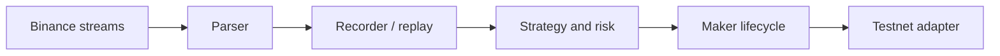

# AnchorBell: Binance Equity Perpetual Anchor-Maker Engine

**English** · [简体中文](README.zh-CN.md)

[](https://www.rust-lang.org/)
[](LICENSE)
[](https://www.binance.com/)
[](docs/TESTNET_AND_BACKTEST.md)

AnchorBell is an open-source, maker-only research and execution engine for
short-horizon trading of Binance equity perpetual contracts around underlying
equity-market closing-price anchors.

It is a research system, not a promise of arbitrage or profit. Every result must
state its data, latency, fill, fee, and risk assumptions.

## What AnchorBell does

During the underlying equity market's closed session, a perpetual contract may
deviate from the last reliable equity-market close. AnchorBell models that close
as a static anchor, evaluates the deviation, places only passive post-only quotes,
and exits before the underlying market reopens.

The system is intentionally narrow:

- Binance equity perpetual contracts.
- Maker-only entry and exit.
- Static closing-price anchor with explicit validity.
- Short-lived exposure inside a defined session window.
- Integer price and quantity ticks at execution boundaries.
- Deterministic replay using the same strategy and risk contracts.
## Architecture

AnchorBell separates market data, strategy, risk, execution, replay, and
exchange adapters. No strategy module is allowed to discover credentials,
open sockets, or mutate exchange state directly.



The critical boundaries are:

| Boundary | Responsibility |
| --- | --- |
| `market` | Parse Binance events, validate decimals, subscribe, and record input |
| `strategy` | Anchor, session, quote, and inventory decisions |
| `execution` | Order intent, lifecycle, risk gate, credentials, and transport contracts |
| `replay` | Timestamp-ordered historical event ingestion |
| `backtest` | Explicit fill assumptions and integer-tick result handling |
| `runtime` | Composition and event-loop integration |

Composition happens at the edges. The core remains usable with paper gateways,
recorded data, or a future Binance network adapter.
## Design principles

1. Maker-only is a hard invariant, not a best-effort preference.
2. Positions are flattened before the underlying market reopens.
3. Invalid anchors, stale data, and exceeded position limits fail closed.
4. Testnet and production endpoints are different typed environments.
5. Credentials are read from the environment and never committed.
6. Exchange effects are acknowledged through explicit lifecycle events.
7. Historical replay is deterministic and rejects out-of-order input.
8. Backtest fills state their assumptions instead of pretending to be executions.
9. Integer ticks are used where precision affects decisions or accounting.
10. Performance optimizations must preserve strategy and risk semantics.

## Testnet and backtesting

The project includes explicit Binance testnet endpoint configuration, a typed signed
order transport boundary, JSONL market recording, event replay, and a conservative
top-of-book fill model.

Testnet can validate authentication, filters, post-only rejects, cancellations,
reconnect behavior, and exchange acknowledgements. It cannot establish live
profitability or reproduce historical liquidity.

Kline-only backtests are insufficient for this maker strategy. A serious replay
should include bookTicker, mark price, anchor snapshots, local receipt timestamps,
latency, queue assumptions, cancel timing, fees, and funding treatment.

See [Testnet and historical replay](docs/TESTNET_AND_BACKTEST.md), the [Testnet runbook](docs/TESTNET_RUNBOOK.md), and the [project roadmap](docs/ROADMAP.md).
## Quick start

The current engine is a Rust workspace.

```powershell
git clone https://github.com/SDFGAEV/AnchorBell.git
cd AnchorBell
cargo test --workspace --locked
cargo run -p static-anchor-engine
```

The default production path is not enabled by the core. Before any testnet
experiment, set credentials only in the process environment:

```powershell
$env:ANCHORBELL_BINANCE_API_KEY = "<testnet-key>"
$env:ANCHORBELL_BINANCE_API_SECRET = "<testnet-secret>"
```

Never place real keys in `.env`, source files, logs, issues, commits, or replay
artifacts. Use testnet credentials only until the complete network and recovery
verification is independently reviewed.
## Repository layout

| Path | Responsibility |
| --- | --- |
| `engine/src/market/` | Binance parsing, subscriptions, and JSONL recording |
| `engine/src/strategy/` | Anchor, session, quote, and inventory policy |
| `engine/src/execution/` | Gateways, lifecycle, risk, credentials, and order transport |
| `engine/src/replay.rs` | Typed historical event replay and incremental ingestion |
| `engine/src/backtest.rs` | Pluggable maker fill assumptions |
| `engine/src/backtest_report.rs` | Integer-tick backtest aggregation |
| `docs/` | Architecture, testnet, replay, and operating notes |
| `Cargo.toml` / `Cargo.lock` | Workspace and locked dependency definitions |
| `LICENSE` | Apache License 2.0 |
| `NOTICE` | Attribution and trademark notice |

## Verification

Run checks against the exact revision being evaluated:

```powershell
cargo fmt --all -- --check
cargo test --workspace --locked
cargo clippy --workspace --all-targets --all-features -- -D warnings
```

The repository contains the core contracts, live adapter boundaries, cryptographic
request signing, and focused safety tests. End-to-end Testnet evidence is still a
separate operational gate and must not be inferred from unit tests alone.
## Security and contribution boundaries

- Do not commit API keys, secrets, private keys, account identifiers, or raw
  authenticated payloads.
- Keep production activation behind an explicit safety policy.
- Do not weaken post-only, session-flatten, stale-data, or position-cap gates.
- Keep network I/O in adapters; keep strategy and risk deterministic.
- Add focused tests and documentation with every behavioral change.
- Use small commits that preserve one ownership boundary at a time.
- Report exact commit SHAs and exact test commands in reviews.

Issues and pull requests should include the symbol or boundary affected, the
reproduction input, the expected invariant, and the evidence used to verify it.

## License

AnchorBell is licensed under the [Apache License 2.0](LICENSE). See [NOTICE](NOTICE) for attribution and trademark context.

This repository is independent open-source research infrastructure. Binance,
market-data providers, and any referenced third-party components remain subject
to their own terms. AnchorBell is not financial advice and does not guarantee
execution, liquidity, compliance, or returns.
